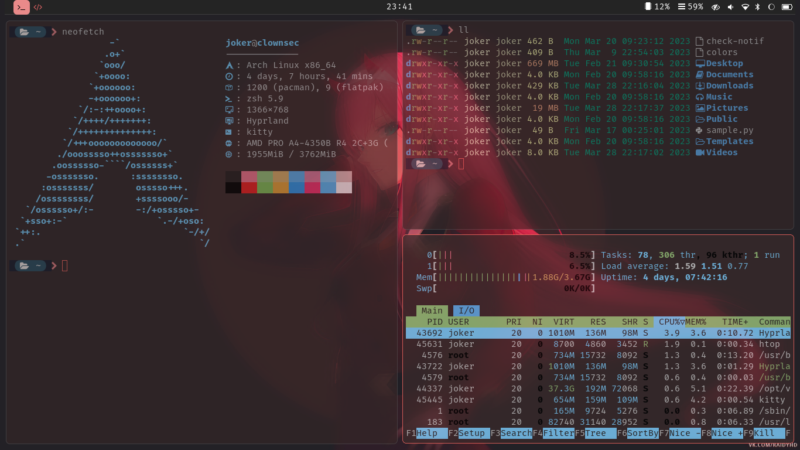
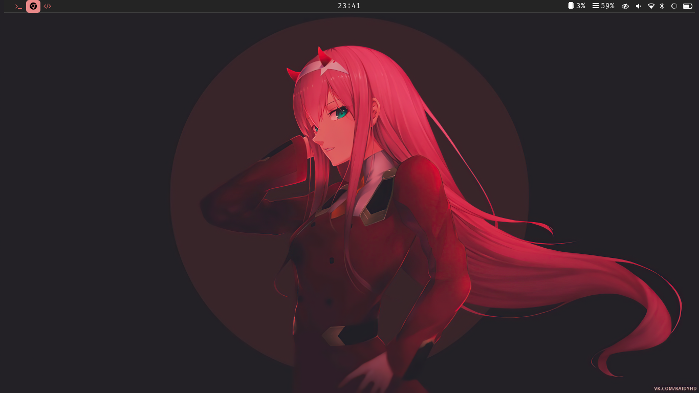
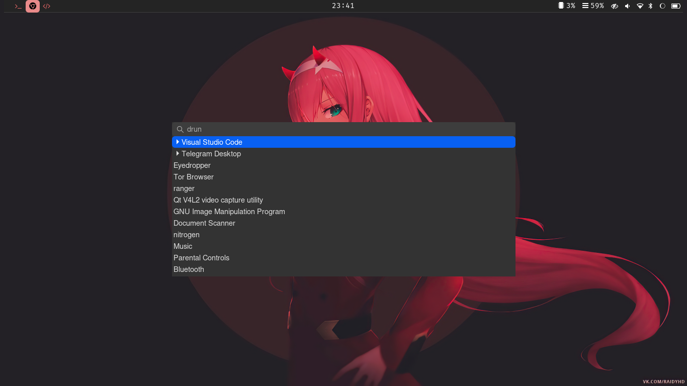
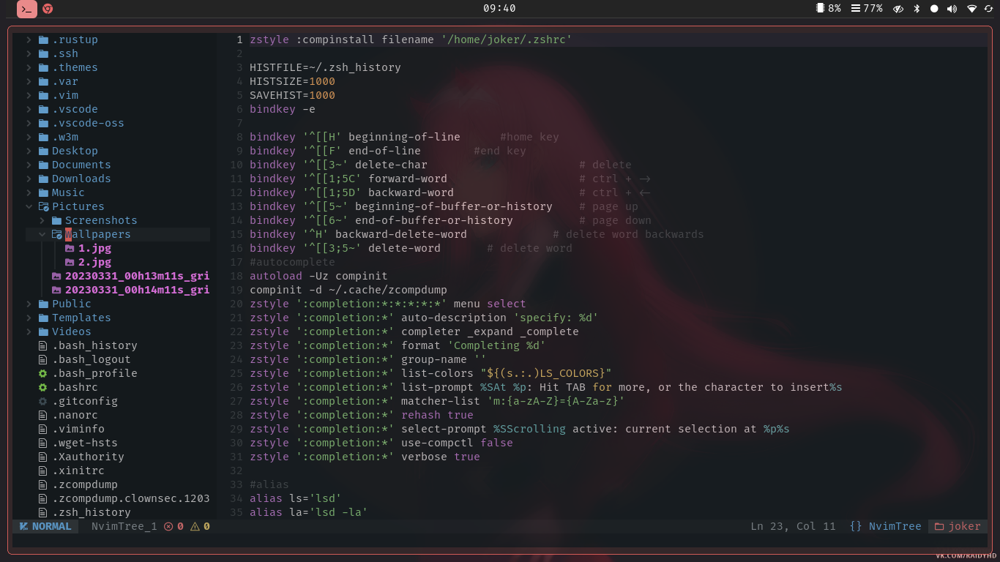

  <h1>Hyprland Dotfiles</h1>
  

    Use at your own risk, these modifications where done according to my taste.
  
  

Screenshots

### Information
Here are some details of what I used.

| Tool | Used |
| ---- | ---- |
| OS | [Arch Linux](https://archlinux.org/) |
| WM | [Hyprland](hyprland.org/) |
| Terminal | [kitty](https://github.com/kovidgoyal/kitty) |
| Shell | [zsh](https://www.zsh.org/) |
| Editor | [NvChad](nvchad.com/)/[Vs Code](https://code.visualstudio.com/) |
| Application Launcher | [Wofi](https://hg.sr.ht/~scoopta/wofi) |
| Bar | [Waybar](https://github.com/Alexays/Waybar) |
| Wallpaper | [Hyprpaper](https://github.com/hyprwm/hyprpaper) |

### Why I chose hyprland?
I've been using gnome in kali linux for years, but with my potato
laptop I couldn't achieve great productivity and speed. I tried arch linux quite few times but faced problems each time, with confidence I tried this time and I came successful after trying bspwm and i3.

- Hyprland is really great and easy to customize compared to other tiling window managers like bspwm,I found it little hard for a newbie like me to setup dual monitor but in hyprland it just gets detected automatically and assigns workspace according to that.

- The great thing which comes useful in auto reload of configuration without any hustle and inbuilt compositor